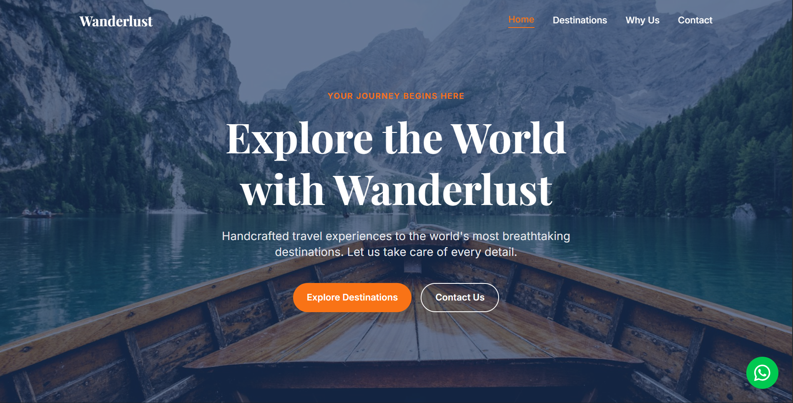

# Wanderlust — Travel Agency Landing Page

A fully responsive, SEO-optimised travel agency landing page built with React 19, Vite, and Tailwind CSS v4. Developed as a professional portfolio project following industry-standard practices including component architecture, environment variables, scroll animations, accessibility, and multi-channel lead generation.

Live Demo: [wanderlust-travel-agency.vercel.app](https://travel-agency-lead-generation-site.vercel.app)

---

## Screenshots

| Desktop | Mobile |
|---|---|
|  |  |

---

## Tech Stack

| Technology | Purpose |
|---|---|
| React 19 | UI library — functional components and hooks |
| Vite | Build tool and dev server |
| Tailwind CSS v4 | Utility-first styling with custom design tokens |
| Formspree | Form submission and email delivery via Fetch API |
| Vercel | Deployment and hosting |
| ESLint + Prettier | Code quality and consistent formatting |

---

## Features

- Blazing fast — Vite build with optimised assets
- Fully responsive — mobile-first layout across all screen sizes
- Custom design system — color tokens and typography scale via Tailwind v4 @theme
- Sticky navbar — transparent on hero, solid on scroll with active section highlighting
- Hamburger menu — animated mobile navigation
- Scroll animations — fade-up entrance effects via Intersection Observer API
- Dual-channel inquiry form — Fetch API POST to Formspree plus WhatsApp redirect with pre-filled message
- WhatsApp widget — sticky floating button for instant contact
- Accessible — semantic HTML, keyboard navigation, focus rings, skip-to-content link, ARIA labels
- Environment variables — sensitive config via Vite .env with VITE_ prefix
- SEO optimised — meta tags, Open Graph, Travel Schema Markup, sitemap, robots.txt (Phase 7)

---

## Folder Structure

```
travel-agency/
├── public/
│   └── images/
├── src/
│   ├── components/
│   │   ├── Button.jsx
│   │   ├── Card.jsx
│   │   ├── SectionTitle.jsx
│   │   └── WhatsAppWidget.jsx
│   ├── hooks/
│   │   └── useScrollAnimation.js
│   ├── sections/
│   │   ├── Navbar.jsx
│   │   ├── Hero.jsx
│   │   ├── Destinations.jsx
│   │   ├── WhyUs.jsx
│   │   ├── Testimonials.jsx
│   │   ├── InquiryForm.jsx
│   │   ├── CTABanner.jsx
│   │   └── Footer.jsx
│   ├── App.jsx
│   ├── main.jsx
│   └── index.css
├── .env
├── .npmrc
├── index.html
└── vite.config.js
```

---

## Development Phases

This project was built following a structured, phase-by-phase professional workflow:

| Phase | Description | Status |
|---|---|---|
| Phase 1 | Project setup — Vite, React, Tailwind, ESLint, Prettier | Complete |
| Phase 2 | Design system — color tokens, typography, global styles | Complete |
| Phase 3 | Component architecture — planning, file structure, wiring | Complete |
| Phase 4 | Building all sections — full UI implementation | Complete |
| Phase 5 | Responsiveness and interactivity — hamburger menu, animations, accessibility | Complete |
| Phase 6 | Polish and deployment — Lighthouse audit, env vars, Vercel deploy | Complete |
| Phase 7 | SEO — react-helmet-async, Schema Markup, sitemap, Core Web Vitals | In Progress |
| Phase 8 | Final deployment — pre-rendering, Google Search Console | Upcoming |

---

## Lighthouse Scores

Tested on mobile via Chrome DevTools Lighthouse audit on production build:

| Category | Score |
|---|---|
| Performance | 88 |
| Accessibility | 96 |
| Best Practices | 100 |
| SEO | 92 |

---

## SEO Implementation (Phase 7)

- react-helmet-async — dynamic meta tags and Open Graph
- Travel Schema Markup — TravelAgency and TouristDestination JSON-LD structured data
- sitemap.xml — search engine indexing
- robots.txt — crawler instructions
- react-snap — pre-rendering for static HTML snapshot
- Core Web Vitals optimization — LCP, CLS, FID
- Google Search Console — site registration and indexing

---

## Local Setup

```bash
# Clone the repository
git clone https://github.com/muhammad-ahmad08/travel-agency-lead-generation-site.git

# Navigate into the project
cd travel-agency-lead-generation-site

# Install dependencies
npm install --legacy-peer-deps

# Create environment variables
cp .env.example .env

# Start the dev server
npm run dev
```

---

## Environment Variables

Create a .env file in the project root:

```env
VITE_FORMSPREE_ENDPOINT=your_formspree_endpoint
VITE_WHATSAPP_NUMBER=your_whatsapp_number
```

---

## Lead Generation Flow

This project implements a dual-channel inquiry system:

```
Visitor fills inquiry form
        |
Fetch API POST to Formspree — email notification delivered
        |
WhatsApp opens with pre-filled inquiry message
```

---

## Connect

Muhammad Ahmad
- GitHub: github.com/muhammad-ahmad08
- LinkedIn: your-linkedin-url
- Portfolio: your-portfolio-url

---

Built as a professional portfolio project.
